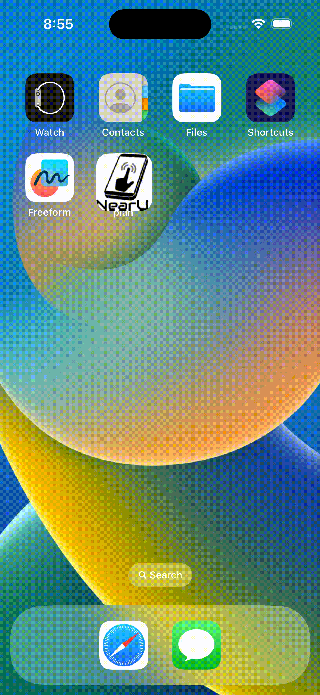
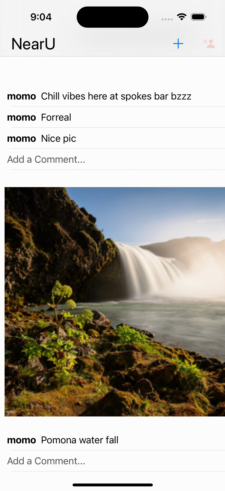

# NearU - Hyperlocal Social Networking iOS App


| WIP |

<br>

NearU is a hyperlocal social networking Native iOS App built in Swift/XCode with a custom Parse backend that allows users to share hyperlocal content in real time, view the local feed, and comment on posts within their local area.

<br>

|          Sign Up/Login       |    Post Content with caption  |
| :--------------------------: | :---------------------------: |
|             |                     |
|  View Posts & Add comments   |        Sign Out               |
| :--------------------------: | :---------------------------: |
|             |                     |


## Requirements

- iOS 9.0+
- [Xcode IDE](https://developer.apple.com/xcode/)
- [Install Cocoapods](https://www.raywenderlich.com/7076593-cocoapods-tutorial-for-swift-getting-started) (a dependency manager)

## Setup
- Clone the Repo
  ```
  $ git clone https://github.com/momonepal/NearU.git
  ```
-  Navigate to the unzipped folder in Terminal and run `pod install`.
- `$ open plan.xcworkspace` and Build the project (⌘+B)

<br>

-------------------------

### For more info on Setting Up
- https://developer.apple.com/xcode/
- https://cocoapods.org/
- https://www.raywenderlich.com/7076593-cocoapods-tutorial-for-swift-getting-started
- https://docs.github.com/en/get-started/getting-started-with-git/about-remote-repositories
